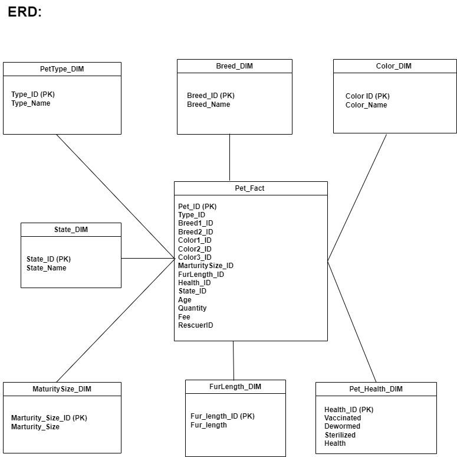
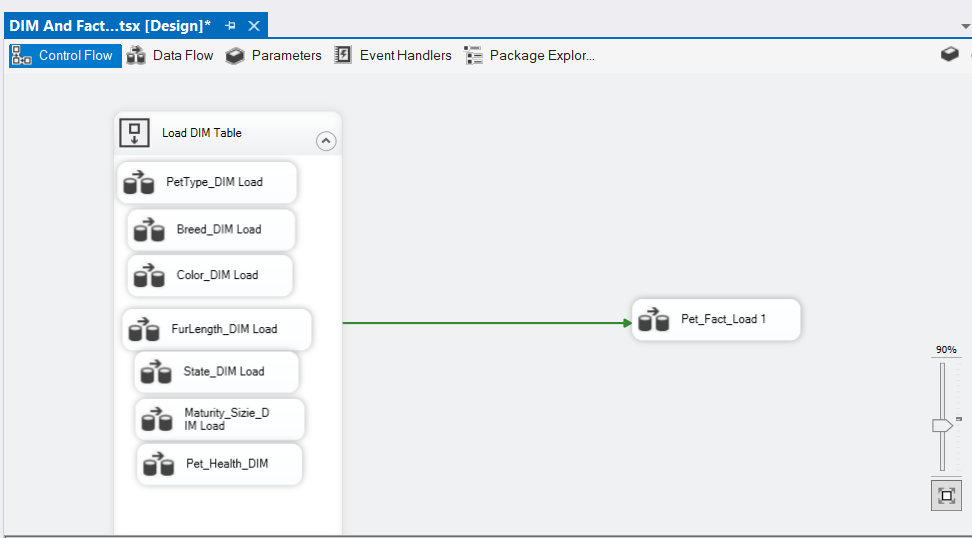
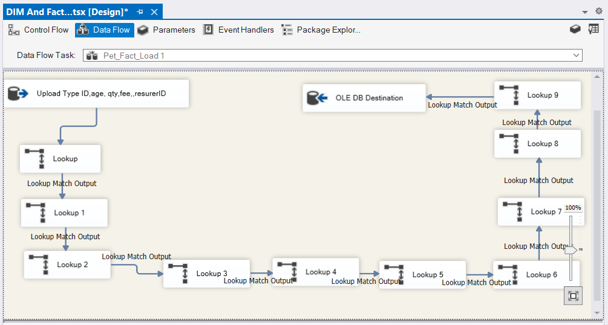
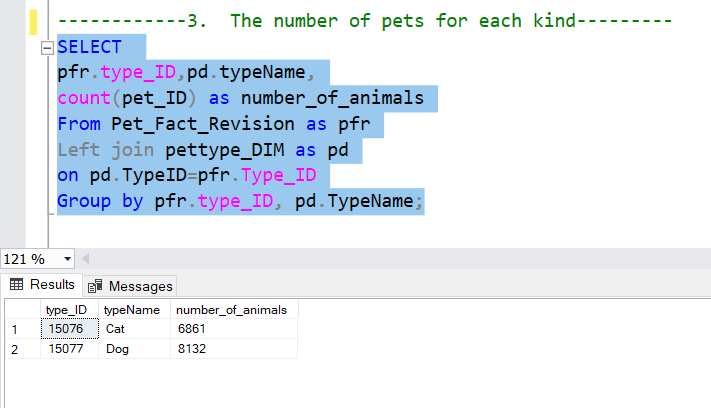

## Description
The project aimed at integrating a dataset about adopted pets into the SQL server. The tool used in the project is Microsoft Visual Studio. 
After the data is integrated into the SQL server, a number of SQL queries have been performed to explore the data and answer business questions. 

##  Entity Relationship Diagram (ERD)
The model is following the star schema. With Pet_Fact is the main fact table connected to the dimension tables. 

## Uploading data to SQL server

The Dimension tables were uploaded first. With Sequence Container, all the Dimension tables were uploaded at the same time to save time. 

Then the fact table was loaded The fact table was linked to Dimension tables using the Lookup function. 

## SQL queries
After the data was uploaded to the SQL server, a number of queries have been done to explore the data: 

1.	How many more-than-3-month-old cats have long fur?
Result: 
 

2.	Top 5 states have the largest number of pets 
Result: 

3.	The number of pets for each kind
Result: 

4.	How many more-than-1-month-old pets met the health requirements (Vaccinated, dewormed, Sterilized, and in a healthy state)? 

