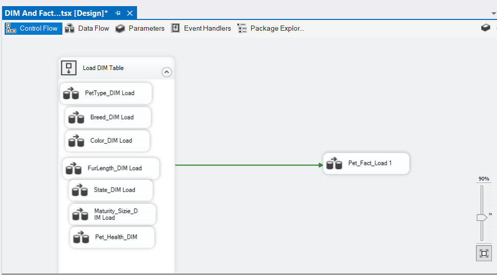
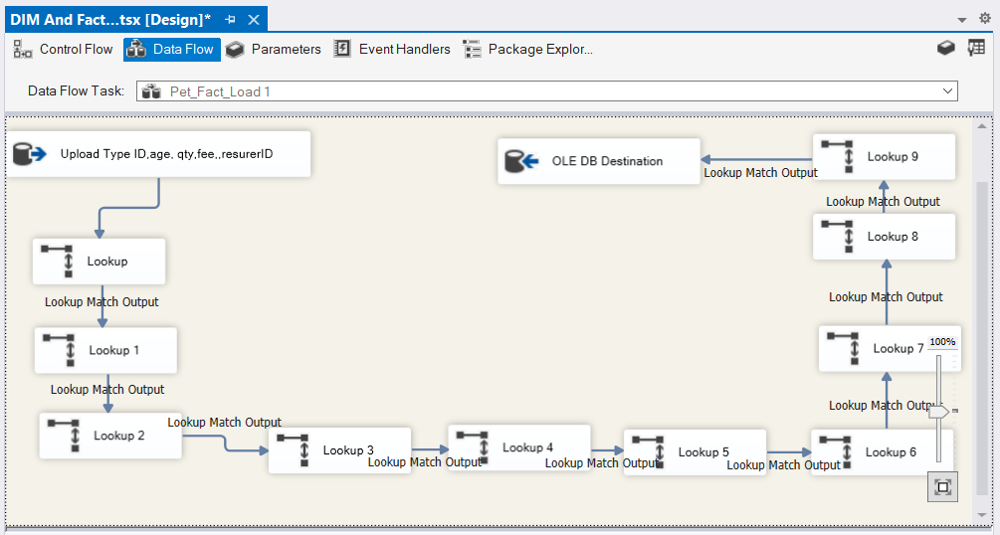
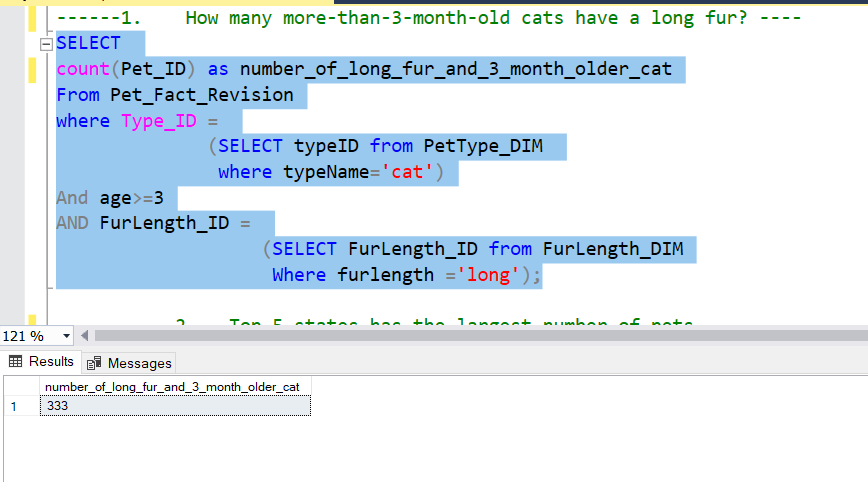
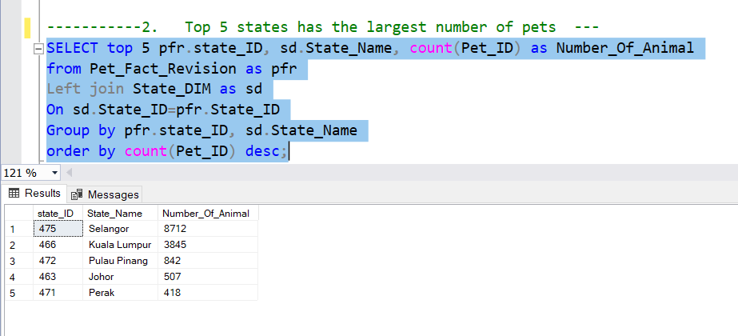
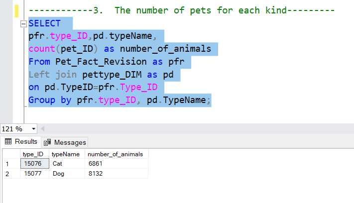
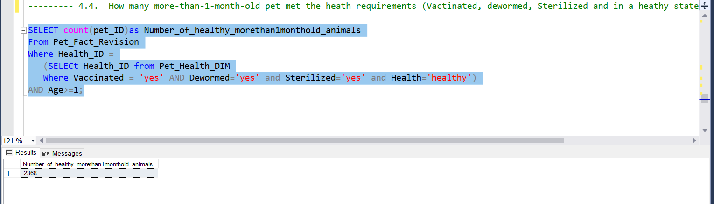

## Description
The project aimed at integrating a dataset about adopted pets to SQL server. The tool used in the project is Microsoft Visual Studio. 
After the data is integrated to data warehouse, a number of SQL queries have been performed to explore the data and answer business questions. 

##  Entity Relationship Diagram (ERD)
The model is following the star schema. With Pet_Fact is the main fact table connected to the dimesion tables. 

## Uploading data to SQL sever

The Dimension tables were uploaded firstly. With Sequence Container, all the Dimension tables were uploaded at the same time to save time. 

Then the fact table was loaded after that. The fact table was linked to Dimention tables using Look up function. 

## SQL queries
After the data was uploaded to SQL server, a number of queries have been done to explore the data: 

1.	How many more-than-3-month-old cats have a long fur?
Result: 

2.	Top 5 states has the largest number of pets 
Result: 

3.	The number of pets for each kind
Result: 

4.	How many more-than-1-month-old pet met the heath requirements (Vactinated, dewormed, Sterilized and in a heathy state)? 
